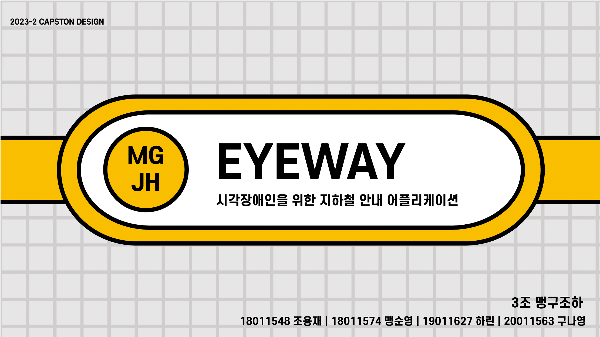
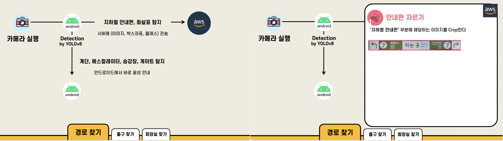
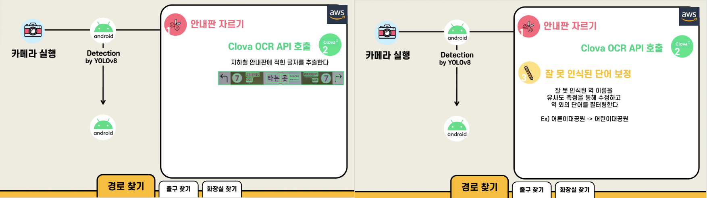
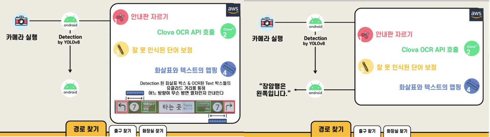

# eyeway: 시각장애인을 위한 지하철 길 안내 어플리케이션





## Flow







출구 찾기과 화장실 찾기 역시 비슷한 플로우로 진행이 됩니다.

(출구 찾기의 경우 '나가는 곳' '출구' 라는 문구가 안내판의 OCR 결과로 추출된다면 작동하게, 화장실 찾기는 화장실 아이콘이 보인다면 작동하게 했습니다.)


## Model

- [YOLOv8](https://github.com/ultralytics/ultralytics) Detection 모델 중 Small 모델 사용

  - Detection 자체가 안드로이드에서 실시간으로 실행이 되어야 했기 때문에 작은 사이즈의 모델로 학습을 진행했습니다.
  - 학습시킨 pt 파일은 onnx로 변환하여 사용하였습니다.
  - 변환한 파일은 안드로이드에서 번갈아가면서 작동 (길찾기 detection -> 장애물 det -> 길 찾기 det ...)
- 학습 및 변환 자체는 문서에 잘 정리되어 있기에 따로 기술하지는 않겠습니다.

## Dataset

- 직접 수집한 지하철 이미지 1000여장 + Roboflow에서 수집한 데이터 1000여장 사용 (https://app.roboflow.com/eyeway)
- Roboflow에서 라벨링 및 데이터를 추출하여 사용했습니다.
- 상황에 따라 총 세가지 데이터셋에 대해서 모델을 학습시켜 사용했습니다.
  - 경로 찾기, 출구 찾기
  - 화장실 찾기
  - 그 외 장애물들
- __Class__
  - ```경로 찾기```, ```출구 찾기```

    - 안내판
    - 화살표 (좌, 우, 직진, 아래)
  - ```출구 찾기```

    - 화장실 아이콘
    - 화장실 입구 (어린이 대공원 한정)
    - 화살표 (좌, 우, 직진, 아래)
  - ```그 외 장애물들```

    - 계단
    - 에스컬레이터
    - 승강장
    - 개찰구


## 길 안내 Flow

- Detection된 결과 (class, box좌표) 를 안드로이드에서 AWS 서버로 보내면 서버에서 후처리가 ```guide.py``` 에서 실행됩니다.
  길 찾기로 설명을 하겠습니다

  1. 안내판과 화살표가 detection 된다면 서버로 데이터가 전송됩니다.
  2. 안내판의 좌표 정보를 통해 해당 부분을 crop하게 되고 이 부분의 이미지를 Clova OCR API를 통해 OCR을 진행합니다.
  3. 안내판 안에서 추출된 단어들 중에 역 이름만 필터링을 하고 잘못 추출된 단어(ex.어른이대공원)가 있을 경우 ```similarity.py``` 에서 유사도 검사를 통해 보정이 됩니다.
  4. 텍스트 박스와 안드로이드에서 detection된 박스 좌표 사이의 유클리드 거리를 측정하여 텍스트 박스를 더 가까이에 있는 화살표와 맵핑합니다.(ex. 석남행 - 왼쪽)
  5. 사용자의 최종 목적지에 따라 필요한 정보만 다시 안드로이드로 보냅니다.

## 실행 결과

- 어린이대공원 -> 군자(환승) -> 아차산(2번출구) 까지의 경로로 테스트를 진행하였습니다.
- 사용자는 팀원 한명이 안대를 끼고 지팡이와 해당 앱만 사용하여 어린이대공원 역에서 지하철 탑승 및 화장실 이용, 아차산역 2번 출구까지 나가는데 성공하였습니다.


## 실험 과정

처음 데이터에 대해서 실험 관리를 WandB로 하다가 사용제한이 떠서 그 뒤로를 사용하지 못했습니다..

1. 처음엔 11개의 모든 데이터 셋에 대하여 한 모델에 학습

   - Box 결과는 나쁘지 않았으나 Classification에서 매우 낮은 수치를 기록 (특히 오른쪽/왼쪽 화살표)
     - Confusion Matrix 확인시 오른쪽/왼쪽 화살표에 대해서 0.1%대의 결과를 얻음
2. 상황에 따라 데이터셋을 세 개로 나누고 augmentation을 통해 데이터 뻠핑

   - Classification 결과가 이전보다 꽤 많이 증가 했으나(0.1 -> 0.3-4% 대 진입) 낮은 수치
   - 해당 서비스가 정량적인 수치의 정확성보다는 정성적인 부분이 중요하다고 생각해 Classification은 이 정도로 멈춤
   - 하지만 box의 location 성능이 전보다 좋지 않음을 확인
3. 따라서 2번의 학습을 진행할 때 1번의 백본 Weight에 Transfer learning을 이용.

   - 백본 가중치를 Freeze 하고 fc layer만 추가 학습
   - 정성적으로 괜찮은 결과를 얻음 (데이터셋이 워낙 적다보니 모든 데이터셋을 학습에 이용하였음)


### 환경

- 학습 환경

  - M1 Pro 14 (AMP 사용에 시간이 더 걸리는 이슈가 있어서 CPU 사용,,)
  - Elice A100 서버
